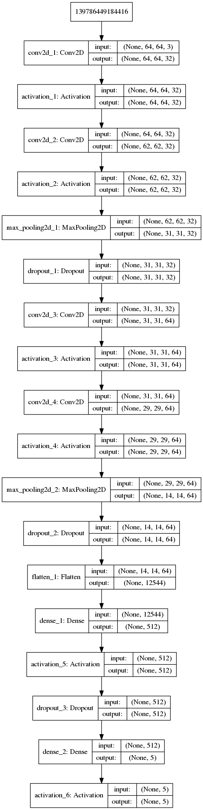
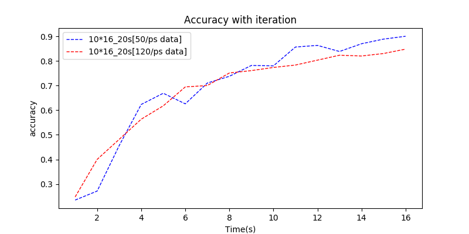
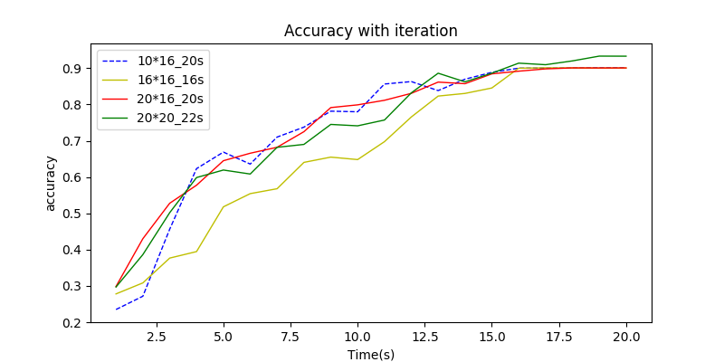

# faceRecognition

This is an classic demo for face recognition based on tensorflow &amp; keras

##### working environment
	Ubuntu 16.04
	python 3.x
	tensorflow(keras) 1.0.x
	opencv(for pytoon) 3.x
	USB camera

##### running step
		

```
step 1 : open video camera  to test whether the camera workd well ot not
	python videoOpen.py 0(linux environment)
step 2: detect the face region using opencv face dectector 
       	#haarcascade_frontalface_alt2.xml or haarcascade_frontalface_alt.xml
       	#in real test, the former seems better
	python faceDetect.py 0
	
step 3: extract face from camera, establish the dataset
	python faceExtract.py 0 120(numbers for each person sampe) dataset/personA
	
step 4: load dataset and label them using python to do this automaticly
	python loadData.py dataset
	
step 5: train dataset with keras and generate the mode.h5 file
	#evaluate the model
	python trainKersa.py
	
step 6: predit the face for real-time test
	python facePredit.py 0
```

##### conclusion

the neural network architecture as follows :



Based on many times for optimizing the hyper peremeter, finally the training accuracy approchs to 98.3% and the test accuracy is about 95.2%

##### comparison between less data(50/person) and more data(120/person)




##### comparison for different batch and epoch



##### reference

https://www.cnblogs.com/neo-T/p/6426029.html
